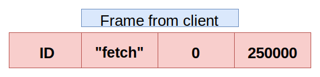

# Sending a file over network with ZMQ

Sending file over a network from one system to another system is sometimes very handy for Industrial IoT applications. Sometimes it is often good to send a batch of updates rather than publishing the updates to subscribers.

The updates which are to be published at certain intervals are written to the file first and then file is sent to the `computing` layer via `broker`.

To try this with `ZMQ` lets create a sample data.

### `testdata`
```text
100
102
100
103
186
375
298
23
```

Let us define `CHUNK_SIZE` to `250000`.

We will be using `czmq` library for this program.

```c
#include <czmq.h>
#define CHUNK_SIZE 250000
```

## Creation of server thread
We allocate a seperate thread using `zthread_fork` function and run `server_thread` function with this thread.

```c
int main (void)
{
    // create a zmq context
    zctx_t *context = zctx_new ();

    // start the server_thread
    zthread_fork (context, server_thread, NULL);
}
```

## The `server_thread`

```c
static void
server_thread
(void *args, zctx_t *ctx, void *pipe)
{
        // open the file testdata in read mode
        FILE *file = fopen ("testdata", "r");

        // make sure file is opened or abort
        assert (file);

        void *router = zsocket_new (ctx, ZMQ_ROUTER);

        // let's set the High Water Mark (HWM) to 1
        zsocket_set_hwm (router, 1);


        // lets bind the socket
        zsocket_bind (router, "tcp://*:6000");
```

The client sends the frame as shown below.



The first frame in each message is the senders identity, so we retrieve the identity from the `identity frame`.

```c
zframe_t *identity = zframe_recv (router);

// if there is no identity, 
// we shutdown this thread

if (! identity)
    break;
```

The second frame is the `fetch` command issued by the `client`.
```c
char *command = zstr_recv (router);
assert (streq (command, "fetch"));
free (command);
```

The third frame is chunk offset in file. So we read the offset from the frame.
```c
char *offset_str = zstr_recv (router);
size_t offset = atoi (offset_str);
free (offset_str);
```

The fourth frame is maximum chunk size. Read the frame and extract the maximum chunk size from it.
```c
char *chunksize_str = zstr_recv (router);
size_t chunksz = atoi (chunksize_str);
free (chunksize_str);
```

Now we read chunk of data from file
```c
fseek (file, offset, SEEK_SET);
byte *data = malloc (chunksz);
assert (data);
```

We now send the resulting chunk of data to client.
```c
size_t size = fread (data, 1, chunksz, file);
zframe_t *chunk = zframe_new (data, size);
zframe_send (&identity, router, ZFRAME_MORE);
zframe_send (&chunk, router, 0);
}
```

At the end we close the file.
```c
fclose (file); 
}
```

Now let's move on to the client thread.

## The `client_thread`

Body of client function
```c
static void
client_thread (void *args, zctx_t *ctx, void *pipe)
{
    // create a dealer socket
    void *dealer = zsocket_new (ctx, ZMQ_DEALER);

    // set the High Water Mark to 1
    zsocket_set_hwm (dealer, 1);

    // connect to server
    zsocket_connect (dealer, "tcp://localhost:6000");
}
```
Let at first the total bytes recieved be `0` and the total number of chunks recieved be `0`.
```c
size_t total = 0;
size_t chunks = 0;
```

Now we start reading the file.

```c
while (true)
{
    // send the fetch request
    zstr_sendm (dealer, "fetch");
    zstr_sendfm (dealer, "%ld", total);
    zstr_sendf (dealer, "%d", CHUNK_SIZE);
```

Now recieve the chunk from the server.
```c
zframe_t *chunk = zframe_recv (dealer);
```

If the chunk is empty then we exit the loop and it is to say that entire file has been sent by ther server and there's nothing left.
```c
if (!chunk)
    break;
chunks ++;
```

Retrive the chunk size from the frame by the help of `zframe_size` function.
```c
size_t size = zframe_size (chunk);
```

```c
// once successfully recieved we print
zframe_print (chunk, "\n");
zframe_destroy (&chunk);
```

Add the size of the chunk recieved to the total size.
```c
total = total + size;
```

Also, when the size of chunk recieved is lesser than the `CHUNK_SIZE` then we exit the loop and print the total number of chunks recieved and also print the total number of bytes recieved.
```c
if (size < CHUNK_SIZE)
    break;
}

printf ("%zd chunks recieved, %zd bytes\n", chunks, total);

// say that we are done. Anything except "fetch" will signal the server_thread to exit.
zstr_send (pipe, "OK");
}
```

