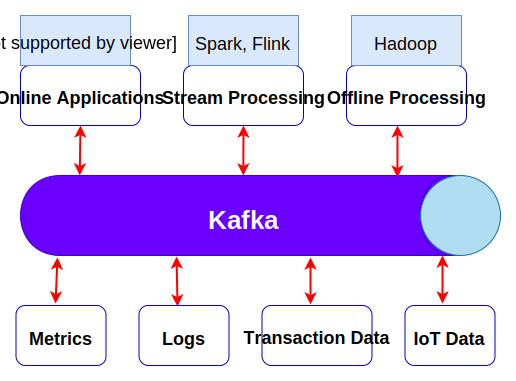

# Apache Kafka - Use Cases

Apache Kafka provides the circulatory system for the data ecosystem, as shown in the figure below. It carries messages between the various members of the infrastructure, providing a consistent interface for all clients. When coupled with the system to provide message schemas, producers and consumers no longer require tight coupling or direct communications of any sort.

# Use cases

## 1. Activity Tracking
A website’s users interact with frontend applications, which generate mes‐
sages regarding actions the user is taking. This can be passive information, such as page views and click tracking, or it can be more complex actions, such as information that a user adds to their profile. The messages are published to one or more topics, which are then consumed by applications on the backend. These applications may be generating reports, feeding machine learning systems, updating search results, or per‐forming other operations that are necessary to provide a rich user experience.

## 2. Messaging
Kafka is also used for messaging, where applications need to send notifications to the users or to any system that is connected to the network.

## 3. Stream processing
Another area that provides numerous types of applications is stream processing. While almost all usage of Kafka can be thought of as stream processing, the term is typically used to refer to applications that provide similar functionality to map/reduce processing in Hadoop. Hadoop usually relies on aggregation of data over a long time frame, either hours or days. Stream processing operates on data in real time, as quickly as messages are produced. Stream frameworks allow users to write small applications to operate on Kafka messages, performing tasks such as counting metrics partitioning messages for efficient processing by other applications, or transforming messages using data from multiple sources.