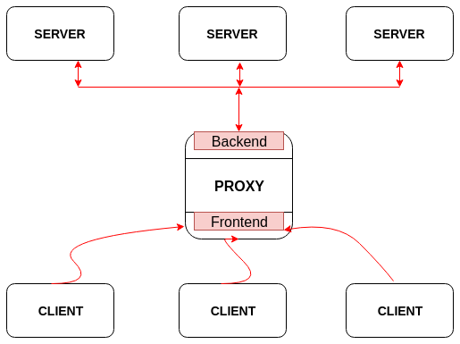

# The concept of `proxy`

Basically in computer networks a proxy server is a server that acts as an intermediary for requests from clients seeking resources from the main servers. The client connects to the proxy server, requesting for a service etc.

Proxies were invented to add structure and encapsulation to distributed systems.

The below block diagram shows the working of `proxy`



----------------
## code for having a proxy

### `1 Defining the context`
```c
// defining the context first
void *context = zmq_ctx_new ();
```

### `2 Creating the frontend`

```c
void *frontend = zmq_socket (context, ZMQ_XSUB);
```

### `3 Assigning the static IP `

The reason we use static IP and proxies are because they give us the freedom to add more `servers /  workers` without the change in topology.

Let us use IP address `localhost:5000` for our frontend.

```c
zmq_connect (frontend, "tcp://localhost:5000");
```

and use the IP `localhost:6000` for our backend where the `workers / servers` sit.

```c
void *backend = zmq_socket (context, ZMQ_XPUB);
zmq_bind (backend, "tcp://localhost:6000");
```

### `4 Run the proxy until the user interrupts`

We could poll the frontend and backend sockets and process the request from the clinet and service their requests via server / workers.
But, with the help of `zmq_proxy` function we can code it in `one` line.

```c
zmq_proxy (frontend, backend, NULL);
```

