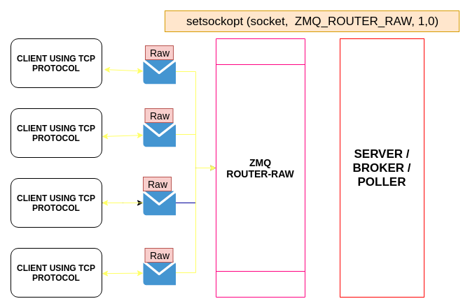

# Using ZMQ_ROUTER_RAW option to achieve communication between ZMQ and non-ZMQ applications.

The option `ZMQ_ROUTER_RAW` sets the raw mode on the `ROUTER`, when set to 1.
When the `ROUTER` socket is in raw mode, and when using the `tcp://` transport, it will read and write TCP data without ØMQ framing. This lets ØMQ applications talk to non-ØMQ applications.

The below figure shows how this is achieved by setting the `ZMQ_ROUTER_RAW` to `1` in `setsockopt`.




So, even if the client uses different protocols our project will be able to recieve the raw messages and we will be able to process the requests of all the client devices connected to our `broker / server`.

## [ UPDATE ]
From ZeroMQ v4 the support for `ZMQ_ROUTER_RAW` is taken down, instead the use of `ZMQ_STREAM` can be used.

The below program shows the usage of `ZMQ_STREAM`.

## # czmq-stream-client

First we include the czmq header file.

```c
#include "czmq.h"
```

Create a context with `zctx_new()`

```c
zctx_t *ctx = zctx_new();
void *sock = zsocket_new(ctx, ZMQ_STREAM);
int rc = zsocket_connect(sock, "tcp://127.0.0.1:5555");
if (rc != 0)
    printf ("%s", zmq_strerror(zmq_errno()));
assert(rc == 0);
```

Retrieve the socket identity. This is important in this particular scenario because when sending data using a 'ZMQ_STREAM' socket the implementation uses the first frame as the *identity* to route the message to. The ZMQ the data to the endpoint.

```c
uint8_t id [256];
size_t id_size = 256;
rc = zmq_getsockopt (sock, ZMQ_IDENTITY, id, &id_size);
assert (rc == 0);
```

Now start sending the message to the server till interrupted.

```c
zframe_t *frame;

while (!zctx_interrupted) 
{
    zmsg_t *msg = zmsg_new ();
    // Supply ZMQ with the identity to route the message to.
    zmsg_addmem (msg, id, id_size);
    // add message data.
    zmsg_addstr (msg, "Hello");
    zmsg_send(&msg, sock);


    // When receiving TCP data, a 'ZMQ_STREAM' socket shall 
    // prepend a frame containing the *identity* of the 
    // originating peer to the message before passing it to 
    // the application. Messages received are fair-queued from 
    // among all connected peers.
    //
    // So in a multi-connection environment our simple
    // assumption that we will receive a reply from the
    // endpoint we just sent a message to is naive but will
    // suffice for this simple test.

    // Read off the *identity* first
    frame = zframe_recv (sock);
    if (!frame)
        break; // interrupted
    zframe_destroy (&frame);

    // Now read off the message.
    char *response = zstr_recv (sock);
    printf ("Response: %s\n", response);
    free (response);

    // crude delay between consequtive requests
    zclock_sleep (2000);
}

zctx_destroy (&ctx);
return 0;
```

## # czmq-stream-server

```c
#include "czmq.h"

int main (void)
{
    zctx_t *ctx = zctx_new();
    void *sock = zsocket_new (ctx, ZMQ_STREAM);

    int rc = zsocket_bind (sock, "tcp://*:5555");
    assert (rc != -1);

    while (!zctx_interrupted) 
    {

        //  Get connection client identity so we can instruct
        // router socket which client to send the response to.

        zframe_t *frame = zframe_recv(sock);
        if (!frame)
            break;       //  Ctrl-C interrupt

        // Read the message
        char *request = zstr_recv (sock);
        printf ("Received: %s\n", request);
        free (request);

        // Send response
        zframe_send (&frame, sock, ZFRAME_MORE + ZFRAME_REUSE);
        zstr_send (sock, "World!");
    }

    zctx_destroy (&ctx);
    return 0;
}
```